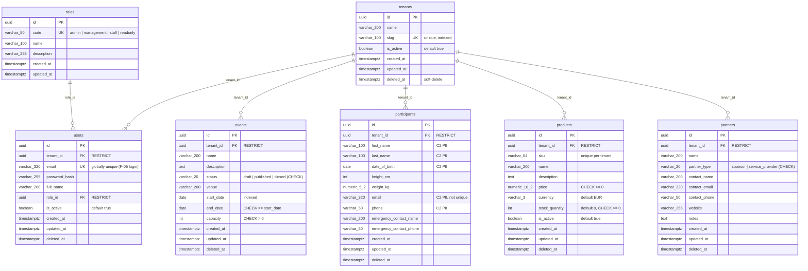

# EOWE Workspace — ER Diagram (Schema v1, F-04)

Generated from migration `a49c23c0ed80` (schema v1 core entities).
All PKs are UUIDs with `gen_random_uuid()` server defaults; all timestamps are
UTC (`timestamptz`). Soft-delete (`deleted_at`) on every business table
(not on `roles` — global fixed catalog). Enums are stored as VARCHAR + CHECK
(`native_enum=False`).

## Indexes (beyond PK/unique)

| Table | Index |
|---|---|
| events | `(tenant_id, status)` composite; `start_date`; `tenant_id` |
| participants | `(tenant_id, last_name)` composite; `tenant_id` |
| users | `email` (unique); `role_id`; `tenant_id` |
| products / partners | `tenant_id` |
| tenants | `slug` (unique) |

## Planned — NOT in v1 (deliberate deferrals)

| Addition | Arrives with | Notes |
|---|---|---|
| `series`, `races`, `distances` | M1-01 (Sprint 2) | Children of `events`; purely additive |
| `registrations` (event ↔ participant) | M1-04 (Sprint 2) | Enrollment junction + capacity enforcement |
| `audit_log` | F-08 (Sprint 2) | F-08 defines actor/action/diff semantics |
| Partner contributions (monetary + in-kind), event links | M5 (Sprint 5) | |
| C3 fields (IBAN, payments, contracts) | M2 (Sprint 4) | Requires at-rest-encryption team decision (SECURITY_STANDARDS §5) |
| Multi-tenancy enforcement (query filtering / RLS) | Module 6 (post-MVP) | `tenant_id` columns already in place — no backfill needed |
| GDPR Art. 17 erasure routine | M1-03 (Sprint 2) | Soft-delete is retention, not erasure — see TODO in `participants/models.py` |
